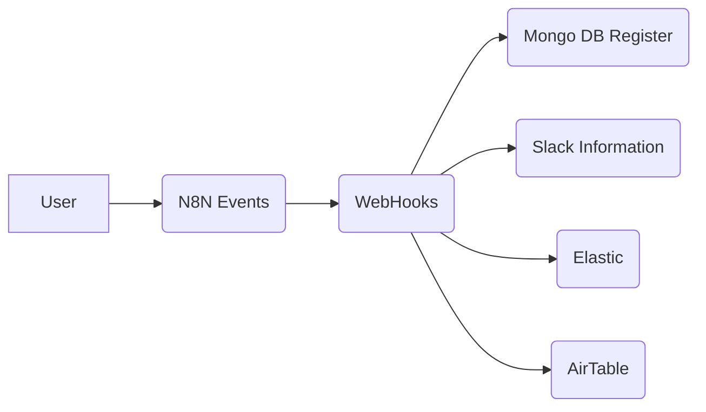

# Welcome to N8N Events

Hello and welcome to my first packeage at NPM, I hope you like the solution.
File containing basic functions for sending events to the N8N in several applications using the webhooks function of the N8N itself.

# Files

> - src/main.js
> - dist/main-min.js

## Use Function

#### Host
> URL of the webhook to which you want to send, remembering that this method is POST

#### Data 
> content you want to send to the webhooks containing the events

#### Function

```
 const sendEvent = await Connection(host, data);
```

##   Script Flow

You must add this function in your respective events that you want to record, such as clicks, sending forms, page that the user accessed and thus recording his data.

Workflow Example



Infinite Possibilities.
Help pull request.
Contact: emerosn@dlweb.co
Good use.